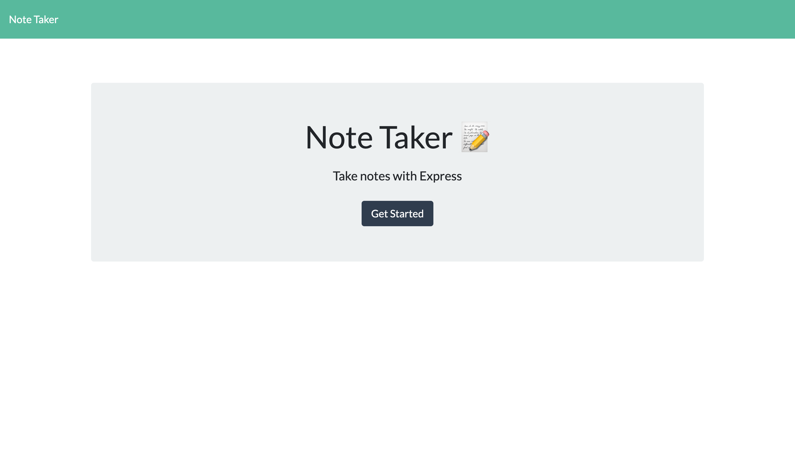

# Express Note Taker

## Description:

This is an application where a user can make reminder notes and save them to the application. The application remembers the notes for the users convenienve. If the user has completed the task or wishes to delete the note for any reason,then the user is able to hit the small trash can beside their previously saved notes and the selected note will then be deleted. 

---

## Table of Contents:

- [Installation](#installation)
- [Technologies](#technologies)
- [Usage](#usage)
- [Contributions](#contributions)
- [Testing](#testing)
- [License](#license)
- [Additional Info](#additional-info)

---

## Installation:

This project uses express so an "npm i" to install express from the dependencies in an integrated terminal will be needed. 

---

## Technologies: 

* Javascript
* Node.js
* CSS
* HTML
* Express
* Heroku (App Deployed Live on Heroku)
* Insomnia (Mock testing for GET and POST)

---

## Usage:

This application will help a user better structure their day. The user can choose a title for their note and then write a list of things to do or reminders and it will be saved to the application. If the user chooses to delete the note, whether is because they finished the task or no longer need the note, then the user can delete the note using the trashcan button out beside the note title of the saved note. 

---

## Testing:

This project has no built in testing, but has been tested internally by the creator.

---

## License:

There are no licenses for this project. 

---

## Screenshots:

 

---

## Additional Info:
- Github: [bvanburenwx](https://github.com/bvanburenwx)
- Email: bvanburenwx@gmail.com
- Application Walkthrough: [Walkthrough](https://drive.google.com/file/d/1fwrjEsY3YGjq8e9RnnNptHWoKeJYv30_/view)
- Deployed Application: [Heroku APP](https://bvanburen-express-note-taker.herokuapp.com/)

